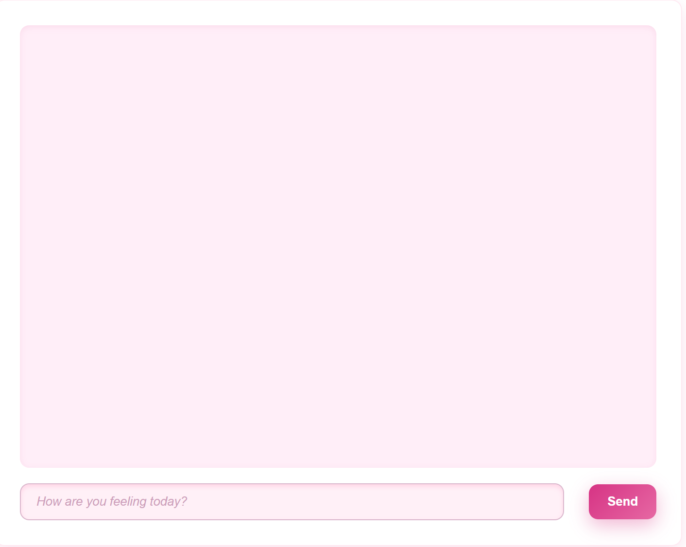
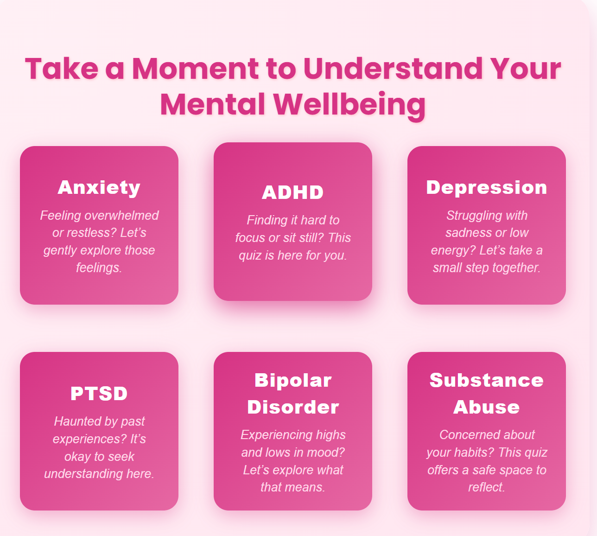
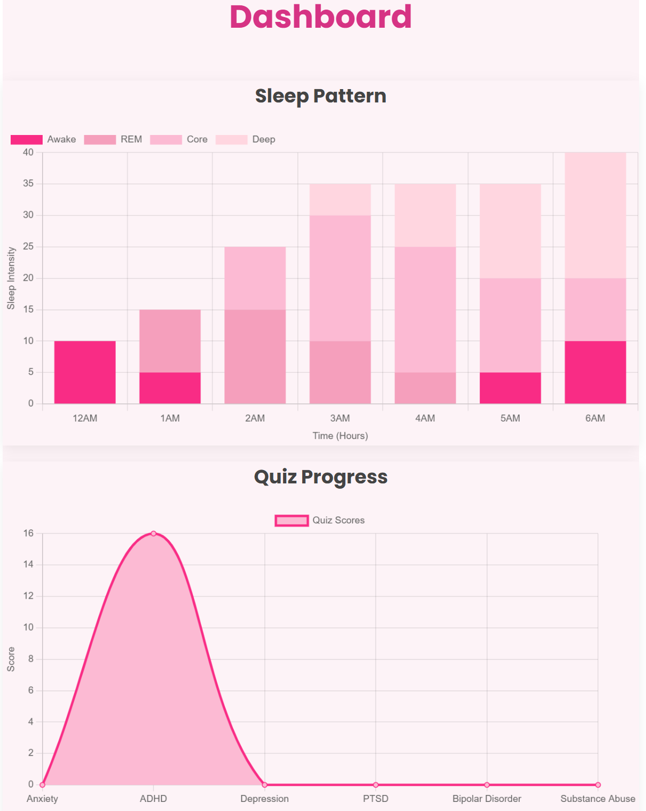
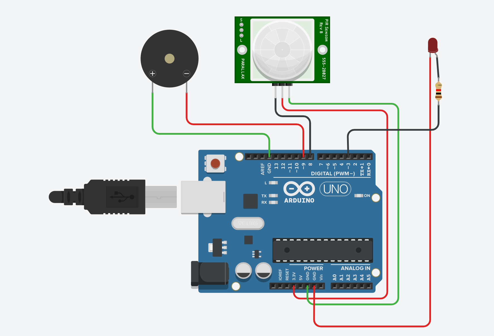

# Mental Health Web Application

## Overview
This is a **Mental Health Web Application** designed to assist users with emotional support, self-assessment, and lifestyle tracking. The app combines a **chatbot powered by Large Language Models (LLMs) via Ollama**, interactive quizzes, a sleep tracker, and a data visualization dashboard, all built with **HTML and CSS** for a user-friendly experience.

The system also includes a **Tinkercad prototype**, demonstrating how hardware integration can enhance the application through automated monitoring.

---

## Features

### 1. Chatbot (Emotional Support)

- Uses **LLMs via Ollama** for human-like, empathetic conversation.
- Provides emotional support, guidance, and coping suggestions.
- Acts as a first point of interaction before seeking professional help.

---

### 2. Mental Health Quizzes

- Includes **six interactive self-assessment quizzes** on:
  - PTSD
  - Bipolar Disorder
  - Anxiety
  - ADHD
  - Depression
  - Substance Abuse
- Each quiz provides **personalized feedback** based on the user's responses.
- Designed to help users reflect on their mental health; **not intended as a medical diagnosis**.

---

### 3. Sleep Tracker

- Users can log **sleep and wake-up times** daily.
- Data is **stored persistently** and can be exported as a **CSV file** for analysis.
- Encourages better sleep habits by tracking patterns over time.

---

### 4. Dashboard (Data Visualization)

- Visualizes user data for better insights and monitoring.
- **Bar Graphs:** Display sleep duration over time, allowing users to track trends in their sleep habits.
- **Line Graphs:** Show quiz results across multiple attempts, highlighting progress or changes in mental health assessments.
- Graphs **update automatically** as users interact with quizzes and the sleep tracker, providing real-time feedback.
- Designed to help users identify patterns and take proactive steps for their well-being.

---

### 5. Tinkercad Prototype

- Demonstrates **conceptual hardware integration** using Tinkercad simulation.
- Shows how IoT devices could automate sleep tracking and environmental monitoring.
- Provides a foundation for extending the application into a smart mental health assistant.

---

## Tech Stack
- **Frontend:** HTML, CSS  
- **AI Integration:** Ollama (Large Language Models)  
- **Data Visualization:** Dynamic bar and line graphs for sleep and quiz tracking  
- **Data Handling:** CSV export for sleep records  
- **Prototype:** Tinkercad simulation for hardware integration  

---

## How It Works
1. **Chatbot Interaction:** Users can interact with the chatbot to receive emotional support.
2. **Self-Assessment Quizzes:** Users choose and complete any of the six quizzes; feedback is displayed immediately.
3. **Sleep Tracking:** Users log sleep and wake-up times, which are saved and can be exported.
4. **Dashboard Visualization:** Users see bar and line graphs representing sleep patterns and quiz results over time.
5. **Tinkercad Prototype:** Demonstrates potential hardware-based enhancements for automated monitoring.

---

## Future Enhancements
- Add **user authentication** for secure multi-user access.
- Integrate **real-time IoT devices** for automatic sleep tracking.
- Expand chatbot with **multilingual support**.
- Include **reminders and alerts** for healthy sleep schedules and quiz retakes.
- Provide more detailed analytics on user progress over time.

---

## Disclaimer
This application is intended for **self-awareness and mental health reflection**. It is **not a substitute for professional medical advice or diagnosis**. Users experiencing serious mental health concerns should seek help from qualified professionals.
