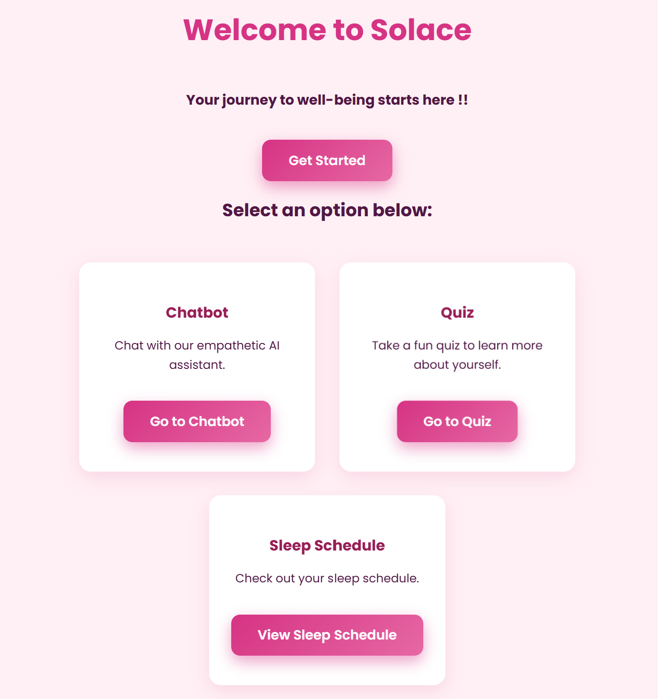
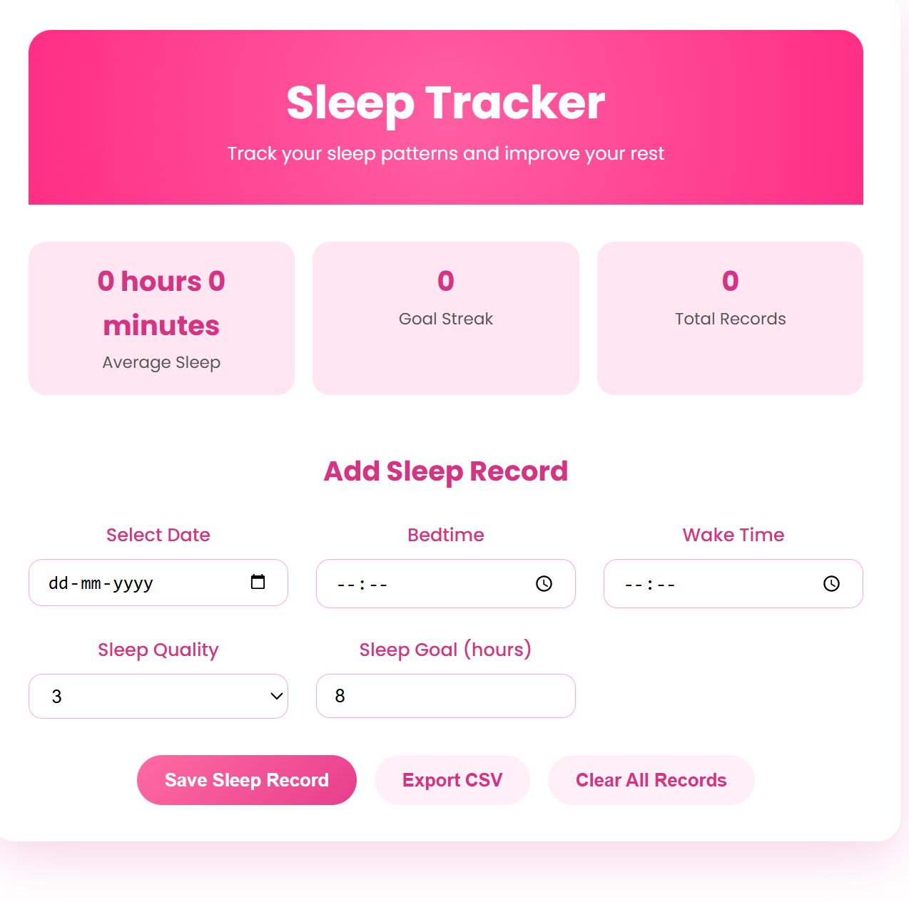

# Mental Health Web Application

## Overview
This is a **Mental Health Web Application** designed to assist users with emotional support, self-assessment, and lifestyle tracking. The application combines a **chatbot powered by Large Language Models (LLMs) via Ollama**, six interactive quizzes, a sleep tracker, and a comprehensive dashboard for visual analytics, all wrapped in a **HTML and CSS frontend** that is responsive and user-friendly.

Additionally, a **Tinkercad prototype** is included, demonstrating the potential integration of IoT devices for automated health monitoring, which can serve as a foundation for future enhancements in smart mental health applications.

---

## Features

### 1. Chatbot (Emotional Support)

- Uses **LLMs via Ollama** to provide human-like and empathetic conversation.
- Offers **emotional guidance**, coping strategies, and general mental health support.
- Designed as the first interaction point for users who may not yet seek professional help.
- Can answer general mental health questions and guide users through app features.

---

### 2. Mental Health Quizzes

- Includes **six interactive self-assessment quizzes**:
  - PTSD
  - Bipolar Disorder
  - Anxiety
  - ADHD
  - Depression
  - Substance Abuse
- Each quiz generates **personalized feedback** based on user responses.
- Helps users **identify potential mental health concerns**, providing awareness without replacing professional diagnosis.
- Users can **track their progress over time** by attempting quizzes periodically.

---

### 3. Sleep Tracker

- Allows users to log **sleep and wake-up times** daily.
- Data is **stored securely** and can be exported as a **CSV file** for personal analysis or sharing with professionals.
- Tracks trends in sleep patterns and helps users understand **sleep quality and consistency**.
- Can be used to correlate sleep patterns with mood or quiz results for holistic insights.

---

### 4. Dashboard (Data Visualization)

- Visualizes user data with **dynamic graphs** for easy interpretation.
- **Bar Graphs:** Show sleep duration over days, highlighting irregularities or improvements.
- **Line Graphs:** Display quiz results over time to help users monitor mental health trends.
- Graphs **update automatically** as new data is logged.
- Helps users **identify patterns**, make informed lifestyle choices, and monitor progress effectively.

---

### 5. Tinkercad Prototype

- Simulates **hardware integration** using Tinkercad.
- Demonstrates how **IoT devices** could automatically log sleep patterns or monitor environmental factors like light and temperature.
- Provides a **proof-of-concept** for potential future enhancements in real-world mental health monitoring.

---

## Tech Stack
- **Frontend:** HTML, CSS (responsive, clean UI design)  
- **AI Integration:** Ollama (Large Language Models for chatbot)  
- **Data Visualization:** Dynamic bar and line graphs for sleep and quiz tracking  
- **Data Handling:** CSV export for sleep records  
- **Prototype:** Tinkercad simulation for hardware integration  

---

## How It Works
1. **Chatbot Interaction:** Users engage with a conversational AI for emotional support and guidance.  
2. **Self-Assessment Quizzes:** Users complete quizzes to gain insights into mental health conditions; feedback is provided instantly.  
3. **Sleep Tracking:** Users log sleep/wake times, which are stored and can be exported for analysis.  
4. **Dashboard Visualization:** Sleep patterns and quiz scores are displayed via bar and line graphs for monitoring trends.  
5. **Tinkercad Prototype:** Shows how IoT devices can automate health tracking, providing a potential smart assistant setup.

---

## Future Enhancements
- **User authentication:** Enable secure, personalized user accounts.  
- **IoT integration:** Automate sleep and environmental data tracking.  
- **Multilingual chatbot:** Support users in different languages.  
- **Reminders & alerts:** Encourage healthy sleep habits and regular quiz checks.  
- **Advanced analytics:** Provide insights on correlations between sleep, quiz scores, and overall well-being.

---

## Disclaimer
This application is intended for **self-awareness and reflection**. It is **not a substitute for professional medical advice, diagnosis, or treatment**. Users experiencing serious mental health issues should consult qualified healthcare professionals.
